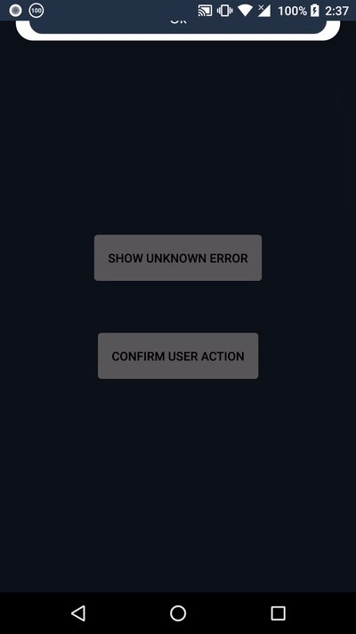

# Android-Custom-AlertBox
Custom AlertBox View for Android with a background overlay, animations and a variety of customizations. 

# Demo


# Download

Add the follwing to your top level gradle file

```allprojects {
    repositories {
        maven { url 'https://jitpack.io' }
    }
}
```

Then add this to your app's gradle dependencies

```
dependencies {
    implementation 'com.github.Talha-Siddiqui3:Android-Custom-AlertBox:1.0'
}
```

# Documentation

AlertBox supports two types of layouts:

1. One buttoned layout: used for showing errors/messages to user where he/she can only acknowledge the message by clicking a single button         (Ok by default).

2. Two buttoned layout: used for asking something from the user where he/she have two choices (Yes and No, by deafult).

## Initialization (XML)

```
<com.rove.android_custom_alert.CustomAlertBox
        android:layout_width="match_parent"
        android:layout_height="match_parent"/>
```
As of now xml doesn't support any customization, but I will add them soon. 

**Note: Make sure to use match parent because the view also uses a background overlay when displaying the alert box, so it needs full layout size for calculating the size of overlay and alertbox.**


## Initialization (Kotlin)

```
 alertBox = CustomAlertBox(context)
        rootLatout?.childCount?.let { a -> rootLatout?.addView(alertBox, a) }
        alertBox?.layoutParams = ConstraintLayout.LayoutParams(
            ConstraintLayout.LayoutParams.MATCH_PARENT,
            ConstraintLayout.LayoutParams.MATCH_PARENT
        )
        
```      

**Note: Make sure to use match parent because the view also uses a background overlay when displaying the alert box, so it needs full layout size for calculating the size of overlay and alertbox.**


## Default usage

### First select the button layout you want to use ie:

```
alertBox?.setDialogType(true) // For single buttoned layout
alertBox?.setDialogType(false) // For two buttoned layout
```

### There are three overloaded methods of setting the message to alert box:
```
 //Use this method for default text for the button(s) selected( one buttoned/two buttoned layout default text of the buttons) and passing just the error/info message.
alertBox?.setDialogMessage(message)


//Use this method for specifying centreButton text along with the error/info message
alertBox?.setDialogMessage(message, centreButtonTextString)


 //Use this method for specifying leftButton text and rightButton text along with the error/info message
 alertBox?.setDialogMessage(message, leftButtonTextString,rightButtonTextString)
```

**NOTE: By deafult centreButtonText is 'Ok', leftButtonText is 'No', and rightButtonText is 'Yes'. Only use the overloaded methods if you need to change the buttons' text.**

### Finally show/hide dialog by these methods:

```
  alertBox?.showDialog()
  alertBox?.hideDialog()
```

### To listen for buttonClickEvents implement the CustomAlertBoxListener in your main activity class / use anonymous class

```
//Use this
   alertBox?.customAlertBoxButtonListener = object : CustomAlertBoxButtonListener {
            override fun onCentreButtonClick() {
               
            }

            override fun onLeftButtonClick() {

            }

            override fun onRightButtonClick() {

            }
        }
        
// Or use this

class MainActivity : CustomAlertBoxButtonListener

 alertBox.customAlertBoxButtonListener=this


    override fun onCentreButtonClick() {
       
    }

    override fun onLeftButtonClick() {
        
    }

    override fun onRightButtonClick() {
      
    }
    
```

### Customization

These all functions provide various custoizations:

1. fun setImage(image: Drawable?, width: Float? = null, height: Float? = null, useSdp:Boolean=false, scaleImageX:Float?=null, scaleImageY:Float?=null)

2. fun configureAlertMessage(font: Typeface? = null, size: Float?=null, color: Int?=null, useSsp:Boolean=false)

3. fun configureLeftButton(font: Typeface? = null, textSize: Float?=null, textColor: Int?=null, buttonHeight:Float?=null, background: Drawable?=null, defaultButtonText:String?=null, useSsp:Boolean=false)

4. fun configureCentreButton(font: Typeface? = null, textSize: Float?=null, textColor: Int?=null, buttonHeight:Float?=null, background: Drawable?=null, defaultButtonText:String?=null, useSsp:Boolean=false)

5. fun configureRightButton(font: Typeface? = null, textSize: Float?=null, textColor: Int?=null,buttonHeight:Float?=null, background: Drawable?=null, defaultButtonText:String?=null, useSsp:Boolean=false)

6. fun setAlertBoxCornerRadius(radius:Float){
        alertBoxCardView.radius=radius
    }

As you can see, every argument is optional, so you can only the use the ones which are needed as per your desire.

**Note1: The argument background means the Background for the button. By deafult, a drawable is used with radius of 15dp and background color is ColorAccent.**

**Note2: I recommened using the sdp/ssp libraries as they provide scalable sizes for different screen sized phones/tablets. However its your choice to either pass the size directly in dp(for ImageView/buttonHeight)/sp(for TextViews) or you can set useSdp/useSsp to true and pass then pass the sizes in sdp/ssp respectively.**

**Note3: If you are using the same alertbox throughout the app, then customization is definitely a redundant task, therefore I would highly recommened the usage of BaseClass to set up your alertbox just once and then extend that BaseClass in all of your activities.
Please refer to Example where I have followed the same design pattern.**

**Note4(IMP): As mentioned above, please refer to Example folder where you can find complete example of all the customization code and the base class design pattern. The same code is used to diplay the Gif above. It will most probably clear all the doubts remaining.**


## Credits
1. https://github.com/intuit/sdp
2. https://github.com/intuit/ssp

These libraries are used in my library code for certain sizes and margins as these provide very good scabale dp/sp, which works on varierty of differnet phone/tablet sizes.

Also, as mentioned above, you can either use standard dp/sp or pass in these sdp/ssp units to the customization functions.

